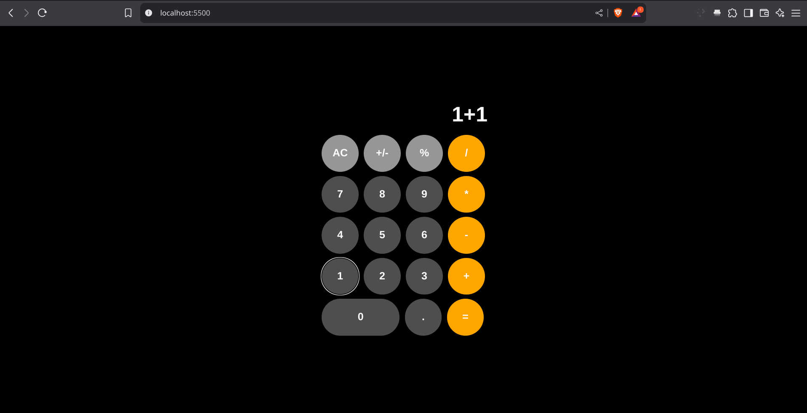

# Simple Calculator Web App

A basic calculator built with HTML, CSS, and JavaScript. Supports addition, subtraction, multiplication, division, and unary minus (`+/-`).

## Features

- Basic arithmetic operations: `+`, `-`, `×`, `÷`
- Unary minus (`+/-`) toggle for negative numbers
- Clear button (`AC`) to reset input
- Real-time expression building
- Math evaluation using `math.js` library

## Technologies Used

- HTML
- CSS
- JavaScript (ES6)
- [math.js](https://mathjs.org/) for safe expression evaluation

## How to Use

1. Clone or download the repository.
2. Open `index.html` in a web browser.
3. Click buttons to build and evaluate expressions.

## File Structure

📁 calculator-app

- index.html # Main structure
- style.css # Styling
- script.js # Calculator logic
- README.md # Documentation.

## Example Screenshot

